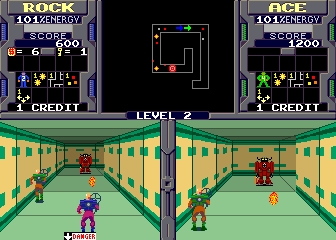
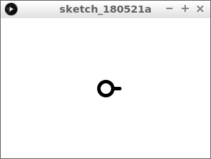
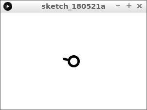
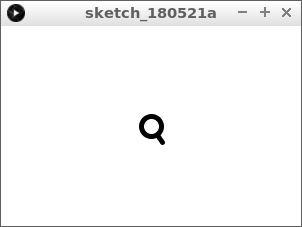
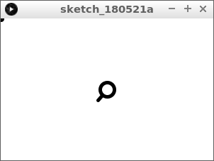
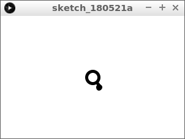
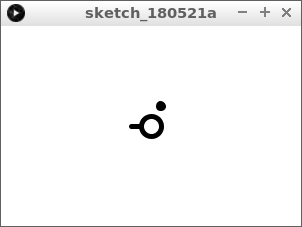
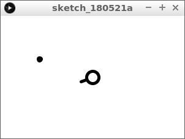

# Sinus en cosinus 4: schieten

In deze les gaan we een sinus en cosinus gebruiken om een kogel te schieten



\pagebreak

## Sinus en cosinus 4: opdracht 1 

Type deze code over:

```c++
float hoek_kanon = 0;

void setup()
{
  size(300, 200);
  strokeWeight(5);
}

void draw()
{
  background(255, 255, 255);
  final float x_midden = width / 2;
  final float y_midden = height / 2;
  final float x_kanon = x_midden + (cos(hoek_kanon) * 20);
  final float y_kanon = y_midden - (sin(hoek_kanon) * 20);  
  line(x_midden, y_midden, x_kanon, y_kanon);
  ellipse(x_midden, y_midden, 20, 20);
}
```

Wat zie je?

\pagebreak

## Sinus en cosinus 4: oplossing 1 



Je ziet een cirkel in het midden, met een kanon

\pagebreak

## Sinus en cosinus 4: opdracht 2

 * Laat het kanon draaien door `hoek_kanon` steeds `0.1` meer te maken



\pagebreak

## Sinus en cosinus 4: oplossing 2 

```c++
float hoek_kanon = 0;

void setup()
{
  size(300, 200);
  strokeWeight(5);
}

void draw()
{
  background(255, 255, 255);
  final float x_midden = width / 2;
  final float y_midden = height / 2;
  final float x_kanon = x_midden + (cos(hoek_kanon) * 20);
  final float y_kanon = y_midden - (sin(hoek_kanon) * 20);  
  line(x_midden, y_midden, x_kanon, y_kanon);
  ellipse(x_midden, y_midden, 20, 20);
  hoek_kanon += 0.1;
}
```

\pagebreak

## Sinus en cosinus 4: opdracht 3

 * Zorg ervoor dat `hoek_kanon` nul wordt, als je op de spatiebalk drukt

Tip:

```c++
if (keyPressed)
{
  if (key == ' ')
  {
    //Zet hoek_kanon op nul
  }
}
```


\pagebreak

## Sinus en cosinus 4: oplossing 3



```c++
float hoek_kanon = 0;

void setup()
{
  size(300, 200);
  strokeWeight(5);
}

void draw()
{
  background(255, 255, 255);
  final float x_midden = width / 2;
  final float y_midden = height / 2;
  final float x_kanon = x_midden + (cos(hoek_kanon) * 20);
  final float y_kanon = y_midden - (sin(hoek_kanon) * 20);  
  line(x_midden, y_midden, x_kanon, y_kanon);
  ellipse(x_midden, y_midden, 20, 20);
  hoek_kanon += 0.1;
  if (keyPressed)
  {
    if (key == ' ')
    {
      hoek_kanon = 0;
    }
  }
}
```

\pagebreak

## Sinus en cosinus 4: opdracht 4

 * Maak bovenaan de variabelen `x_kogel` en `y_kogel`
 * Zet de beginwaarden van `x_kogel` en `y_kogel` op nul
 * Teken een kogel met middelpunt `(x_kogel, y_kogel)` met een cirkel die 5 pixels breed en hoog is



\pagebreak

## Sinus en cosinus 4: oplossing 4

```c++
float hoek_kanon = 0;
float x_kogel = 0;
float y_kogel = 0;

void setup()
{
  size(300, 200);
  strokeWeight(5);
}

void draw()
{
  background(255, 255, 255);
  final float x_midden = width / 2;
  final float y_midden = height / 2;
  final float x_kanon = x_midden + (cos(hoek_kanon) * 20);
  final float y_kanon = y_midden - (sin(hoek_kanon) * 20);  
  line(x_midden, y_midden, x_kanon, y_kanon);
  ellipse(x_midden, y_midden, 20, 20);
  ellipse(x_kogel, y_kogel, 5, 5);
  hoek_kanon += 0.1;
  if (keyPressed)
  {
    if (key == ' ')
    {
      hoek_kanon = 0;
    }
  }
}
```

\pagebreak

## Sinus en cosinus 4: opdracht 5

 * Als je op de spatiebalk drukt, dan ...
    * krijgt `x_kogel` de waarde van `x_kanon`
    * krijgt `y_kogel` de waarde van `y_kanon`
    * blijft het kanon gewoon doordraaien



\pagebreak

## Sinus en cosinus 4: oplossing 5

```c++
float hoek_kanon = 0;
float x_kogel = 0;
float y_kogel = 0;

void setup()
{
  size(300, 200);
  strokeWeight(5);
}

void draw()
{
  background(255, 255, 255);
  final float x_midden = width / 2;
  final float y_midden = height / 2;
  final float x_kanon = x_midden + (cos(hoek_kanon) * 20);
  final float y_kanon = y_midden - (sin(hoek_kanon) * 20);  
  line(x_midden, y_midden, x_kanon, y_kanon);
  ellipse(x_midden, y_midden, 20, 20);
  ellipse(x_kogel, y_kogel, 5, 5);
  hoek_kanon += 0.1;
  if (keyPressed)
  {
    if (key == ' ')
    {
      x_kogel = x_kanon;
      y_kogel = y_kanon;
    }
  }
}
```

\pagebreak

## Sinus en cosinus 4: opdracht 6

 * Maak een nieuwe variabele boven de `setup functie` met de naam `hoek_kogel`
 * Geef `hoek_kogel` de beginwaarde nul
 * Laat `x_kogel` steeds meer worden met de cosinus van `hoek_kogel`
 * Laat `y_kogel` steeds *minder* worden met de sinus van `hoek_kogel`



\pagebreak

## Sinus en cosinus 4: oplossing 6

```c++
float hoek_kanon = 0;
float x_kogel = 0;
float y_kogel = 0;
float hoek_kogel = 0;

void setup()
{
  size(300, 200);
  strokeWeight(5);
}

void draw()
{
  background(255, 255, 255);
  final float x_midden = width / 2;
  final float y_midden = height / 2;
  final float x_kanon = x_midden + (cos(hoek_kanon) * 20);
  final float y_kanon = y_midden - (sin(hoek_kanon) * 20);
  x_kogel += cos(hoek_kogel);
  y_kogel -= sin(hoek_kogel);
  line(x_midden, y_midden, x_kanon, y_kanon);
  ellipse(x_midden, y_midden, 20, 20);
  ellipse(x_kogel, y_kogel, 5, 5);
  hoek_kanon += 0.1;
  if (keyPressed)
  {
    if (key == ' ')
    {
      x_kogel = x_kanon;
      y_kogel = y_kanon;
    }
  }
}
```

\pagebreak

## Sinus en cosinus 4: Eindopdracht

Nu maken we het spel af:

 * Zorg dat de kogel in het begin niet zichtbaar is (tip: zet `y_kogel` op min honderd)
 * Als de spatie ingedrukt wordt, zet dan `hoek_kogel` gelijk aan `hoek_kanon`


