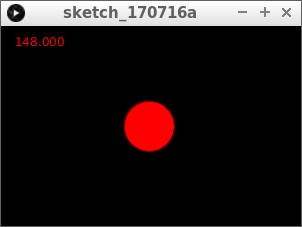
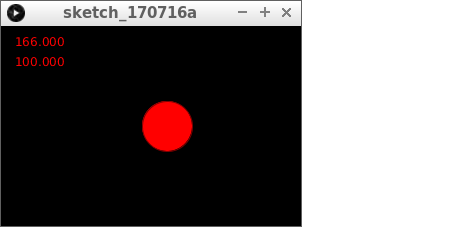
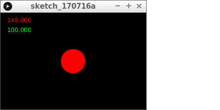
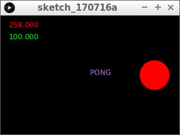
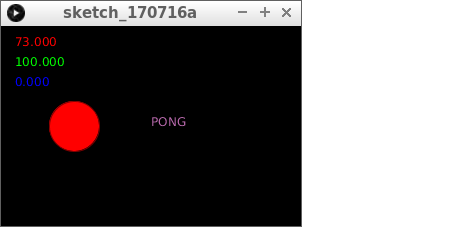
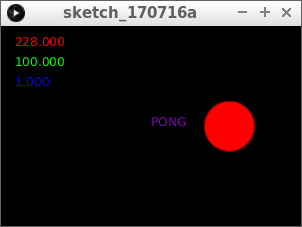

# `text`

Tekst wordt veel gebruikt, ook in games, voor bijvoorbeeld een score.

Hier zie je 'Zork, the underground empire`, een van de beroemdste
tekstavonturen ooit:


In deze les gaan we leren 

 * hoe je tekst op het scherm zet
 * hoe je berekeningen op het scherm zet
 * hoe je tekst vergroot
 * hoe je tekst een kleur geeft

## Opdracht 1

Run deze code:


```c++
float x = 150;
float y = 100;
float snelheid_naar_rechts = 1;

void setup()
{
  size(300, 200);
}

void draw()
{
  background(0, 0, 0);
  stroke(128, 0, 0);
  fill(255, 0, 0);
  ellipse(x, y, 50, 50);
  x = x + snelheid_naar_rechts;
  if (x > 275)
  {
    snelheid_naar_rechts = -snelheid_naar_rechts;
  }
  if (x < 25)
  {
    snelheid_naar_rechts = -snelheid_naar_rechts;
  }
}
```

## Oplossing 1


## Opdracht 2

Voeg na `ellipse` de volgende regel toe:

```c++
text(x, 10, 20);
```

## Oplossing 2



```c++
float x = 150;
float y = 100;
float snelheid_naar_rechts = 1;

void setup()
{
  size(300, 200);
}

void draw()
{
  background(0, 0, 0);
  stroke(128, 0, 0);
  fill(255, 0, 0);
  ellipse(x, y, 50, 50);
  text(x, 10, 20);
  x = x + snelheid_naar_rechts;
  if (x > 275)
  {
    snelheid_naar_rechts = -snelheid_naar_rechts;
  }
  if (x < 25)
  {
    snelheid_naar_rechts = -snelheid_naar_rechts;
  }
}
```

 | 
:-------------:|:----------------------------------------: 
`text(100, 200, 300);`|'Lieve computer, zet de tekst `100` op het scherm met als linkerbovenhoek `(200, 300)`
`text("Hallo", 100, 200);`|'Lieve computer, zet de tekst `Hallo` op het scherm met als linkerbovenhoek `(100, 200)`

## Opdracht 3



Het programma laat nu de `x` zien. Laat eronder nu ook de `y` coordinaat op het scherm zien.

## Oplossing 3

```c++
float x = 150;
float y = 100;
float snelheid_naar_rechts = 1;

void setup()
{
  size(300, 200);
}

void draw()
{
  background(0, 0, 0);
  stroke(128, 0, 0);
  fill(255, 0, 0);
  ellipse(x, y, 50, 50);
  text(x, 10, 20);
  text(y, 10, 40);
  x = x + snelheid_naar_rechts;
  if (x > 275)
  {
    snelheid_naar_rechts = -snelheid_naar_rechts;
  }
  if (x < 25)
  {
    snelheid_naar_rechts = -snelheid_naar_rechts;
  }
}
```

## Opdracht 4



Met `fill` kun je de kleur van je tekst bepalen. 
Na de eerste `text`, zet de fill op groen.

## Oplossing 4

```c++
float x = 150;
float y = 100;
float snelheid_naar_rechts = 1;

void setup()
{
  size(300, 200);
}

void draw()
{
  background(0, 0, 0);
  stroke(128, 0, 0);
  fill(255, 0, 0);
  ellipse(x, y, 50, 50);
  text(x, 10, 20);
  fill(0, 255, 0);
  text(y, 10, 40);
  x = x + snelheid_naar_rechts;
  if (x > 275)
  {
    snelheid_naar_rechts = -snelheid_naar_rechts;
  }
  if (x < 25)
  {
    snelheid_naar_rechts = -snelheid_naar_rechts;
  }
}
```

## Opdracht 5



Zet de tekst `PONG` bovenin en midden op het scherm.
De tekst moet een willekeurige kleur krijgen.
Gebruik `width` om het midden te bepalen.

```c++
float x = 150;
float y = 100;
float snelheid_naar_rechts = 1;

void setup()
{
  size(300, 200);
}

void draw()
{
  background(0, 0, 0);
  stroke(128, 0, 0);
  fill(255, 0, 0);
  ellipse(x, y, 50, 50);
  text(x, 10, 20);
  fill(0, 255, 0);
  text(y, 10, 40);
  fill(random(255), random(255), random(255));
  text("PONG", width / 2, height / 2);
  x = x + snelheid_naar_rechts;
  if (x > 275)
  {
    snelheid_naar_rechts = -snelheid_naar_rechts;
  }
  if (x < 25)
  {
    snelheid_naar_rechts = -snelheid_naar_rechts;
  }
}
```

## Opdracht 6



Maak een variabele erbij: `aantal_botsingen`.
`aantal_botsingen` heeft als beginwaarde nul.
Zet deze waarde op het scherm, in het wit.ex

## Oplossing 6

```c++
float x = 150;
float y = 100;
float snelheid_naar_rechts = 1;
float botsingen = 0;

void setup()
{
  size(300, 200);
}

void draw()
{
  background(0, 0, 0);
  stroke(128, 0, 0);
  fill(255, 0, 0);
  ellipse(x, y, 50, 50);
  text(x, 10, 20);
  fill(0, 255, 0);
  text(y, 10, 40);
  fill(0, 0, 255);
  text(botsingen, 10, 60);
  fill(random(255), random(255), random(255));
  text("PONG", width / 2, height / 2);
  x = x + snelheid_naar_rechts;
  if (x > 275)
  {
    snelheid_naar_rechts = -snelheid_naar_rechts;
  }
  if (x < 25)
  {
    snelheid_naar_rechts = -snelheid_naar_rechts;
  }
}
```

## Opdracht 7



Maak `botsingen` hoger als de bal teken de rechter muur komt.

## Oplossing 7

```c++
float x = 150;
float y = 100;
float snelheid_naar_rechts = 1;
float botsingen = 0;

void setup()
{
  size(300, 200);
}

void draw()
{
  background(0, 0, 0);
  stroke(128, 0, 0);
  fill(255, 0, 0);
  ellipse(x, y, 50, 50);
  text(x, 10, 20);
  fill(0, 255, 0);
  text(y, 10, 40);
  fill(0, 0, 255);
  text(botsingen, 10, 60);
  fill(random(255), random(255), random(255));
  text("PONG", width / 2, height / 2);
  x = x + snelheid_naar_rechts;
  if (x > 275)
  {
    snelheid_naar_rechts = -snelheid_naar_rechts;
    botsingen = botsingen + 1;
  }
  if (x < 25)
  {
    snelheid_naar_rechts = -snelheid_naar_rechts;
  }
}
```

## Eindopdracht


Zet linksboven de tekst: `aantal botsingen:` in het wit.
Zet daaronder de waarde van `botsingen` in het wit.
Haal de rest van de tekst weg.
Het aantal botsingen moet ook hoger worden als je links botst.
