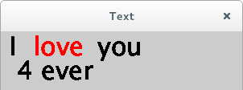

# text

Tekst wordt veel gebruikt, ook in games, voor bijvoorbeeld een score.

Hier zie je 'Zork, the underground empire`, een van de beroemdste
tekstavonturen ooit:


In deze les gaan we leren 

 * hoe je tekst op het scherm zet
 * hoe je berekeningen op het scherm zet
 * hoe je tekst vergroot
 * hoe je tekst een kleur geeft

Zo gaat het eruit zien:



Kun je nog geen puntjes tekenen? Ga dan 
[naar de les waarin je puntjes leert tekenen](../Point/README.md)

Kun je nog geen vlakken inkleuren? Ga dan 
[naar de les 'fill'](../Fill/README.md)

## Tekst

Hier zie je de tekst 'Hallo' laat zetten op coordinaat (10,20):

```
text("Hallo", 10, 20);
```
Let op dat de tekst tussen dubbele apostroffen (`"`) moet.

`text` kan ook rekenen!

Hier plus en min:

```
text(128 + 64, 10, 20);
text(128 - 64, 10, 20);
```

Hier een keersom: 

```
text(16 * 16, 10, 20);
```

Hier een deelsom:

```
text(256 / 16, 10, 20);
```

Tekstgrootte kun je aanpassen met

```
textSize(32);
```

Tekstkleur kun je aanpassen met `fill`:

```
fill(255, 0, 0);
```

## Opdracht

Zet de tekst `I love you 4 ever` op het scherm, waarbij:

 * alle woorden zwart zijn, behalve `love`, die rood is
 * de `4` is de uitkomst van een berekening, bijvoorbeeld `2 + 2` (maar hoe moeilijker de berekening, hoe stoerder)


