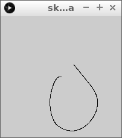
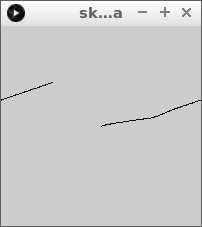
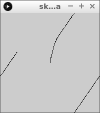
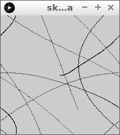

# Toetsenbord 3: Terminator II

In deze les gaan we een puntje besturen met het toetsenbord.


## Intro



Dit is onze begincode. Type deze code over:

```c++
float x = 0;
float y = 0;

float dx = 0; // Snelheid naar rechts
float dy = 0; // Snelheid naar onder

void setup()
{
  size(200,200);
  x = width / 2;
  y = height / 2;
}

void draw()
{
  if (keyPressed)
  {
    if (key == 'w') dy = dy - 0.01;
    if (key == 'd') dx = dx + 0.01;
    if (key == 's') dy = dy + 0.01;
    if (key == 'a') dx = dx - 0.01;
  }
  x = x + dx;
  y = y + dy;
  point(x,y);
}
```

Start het programma en druk op ADSW om van richting te veranderen.

 | In het Engels gebruik je een punt in een komma-getal
:-------------:|:----------------------------------------: 

## Opdracht 1

Zorg ervoor dat als de speler rechts het beeld uit gaat, dat
'ie aan de rechterkant verschijnt.



## Oplossing 1

Je hebt een `if`-statement nodig:

```c++
float x = 0;
float y = 0;

float dx = 0; // Snelheid naar rechts
float dy = 0; // Snelheid naar onder

void setup()
{
  size(200,200);
  x = width / 2;
  y = height / 2;
}

void draw()
{
  if (keyPressed)
  {
    if (key == 'w') dy = dy - 0.01;
    if (key == 'd') dx = dx + 0.01;
    if (key == 's') dy = dy + 0.01;
    if (key == 'a') dx = dx - 0.01;
  }
  x = x + dx;
  y = y + dy;
  if (x > width) x = 0;
  point(x,y);
}
```

 | 
:-------------:|:----------------------------------------: 
`if (x > width) x = 0`|'Lieve computer, als `x` groter is dan `width`, zet `x` dan op nul.'

## Opdracht 2

Zorg ervoor dat *ook* als de speler bovenaan het beeld uit gaat, dat
'ie aan de onderkant verschijnt.



## Oplossing 2

```c++
float x = 0;
float y = 0;

// 0: omhoog
// 1: naar rechts
// 2: omlaag
// 3: naar links
int richting = 1;

void setup()
{
  size(200,200);
  x = width / 2;
  y = height / 2;
}

void draw()
{
  if (keyPressed)
  {
    if (key == 'w') richting = 0;
    if (key == 'd') richting = 1;
    if (key == 's') richting = 2;
    if (key == 'a') richting = 3;
  }
  if (richting == 0) y = y - 1;
  if (richting == 1) x = x + 1;
  if (richting == 2) y = y + 1;
  if (richting == 3) x = x - 1;
  if (x > width) x = 0;
  if (y < 0) y = height;
  point(x,y);
}
```

## Eindopdracht

Zorg ervoor dat de speler altijd in het beeld blijft.


