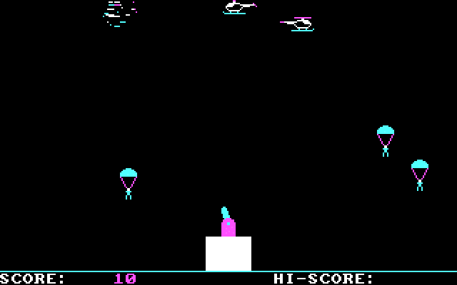
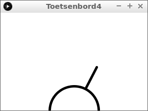
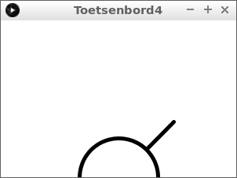
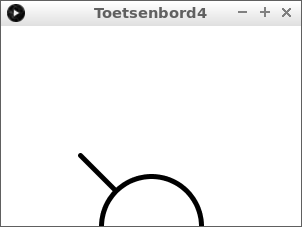

# Toetsenbord 4: Paratrooper

In deze les gaan we een kanon besturen met de pijltjes.



\pagebreak

## Toetsenbord 4: intro



Dit is onze begincode. Type deze code over:

```c++
float hoek = 1.5707963268; // De helft van pi

void setup()
{
  size(300, 200);  
  strokeWeight(5);
}

void draw()
{
  background(255, 255, 255);
  final float x1 = width / 2;
  final float y1 = height;
  final float x2 = x1 + (cos(hoek) * 100);
  final float y2 = y1 - (sin(hoek) * 100);  
  line(x1, y1, x2, y2);
  ellipse(x1, y1, 100, 100);
  
  if (keyPressed)
  {
    if (keyCode == LEFT) hoek += 0.01;
    if (keyCode == RIGHT) hoek -= 0.01;
  }
}
```

Start het programma en met de pijltjes naar links en rechts kun je het kanon besturen 

 | Met `final` zeg je dat een variabele niet mag veranderen
:-------------:|:----------------------------------------: 

\pagebreak

## Toetsenbord 4: opdracht 1

Zorg ervoor dat de hoek van het kanon niet onder 
de 0,7853981634 (een kwart pi) komt. 
Het kanon moet dan blijven op die hoek.



\pagebreak

## Toetsenbord 4: oplossing 1

Je hebt een `if`-statement nodig:

```c++
float hoek = 1.5707963268; // De helft van pi

void setup()
{
  size(300, 200);  
  strokeWeight(5);
}

void draw()
{
  background(255, 255, 255);
  final float x1 = width / 2;
  final float y1 = height;
  final float x2 = x1 + (cos(hoek) * 100);
  final float y2 = y1 - (sin(hoek) * 100);  
  line(x1, y1, x2, y2);
  ellipse(x1, y1, 100, 100);
  
  if (keyPressed)
  {
    if (keyCode == LEFT) hoek += 0.01;
    if (keyCode == RIGHT) hoek -= 0.01;
  }
  if (hoek < 0.7853981634) hoek = 0.7853981634; //Een kwart pi
}
```

\pagebreak

## Toetsenbord 4: eindopdracht

Zorg ervoor dat de hoek van het kanon niet boven 
de 2,35619449019 (driekwart pi) komt. 
Het kanon moet dan blijven op die hoek.


