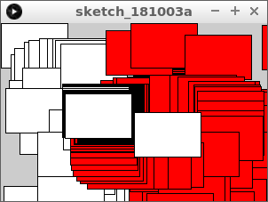
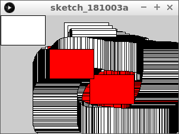

# Vierkanten botsen

In deze les gaan we leren hoe je kunt meten of twee vierkanten botsen

\pagebreak

## Vierkanten botsen: opdracht 1

Type deze code over:

```c++
float x1 = 150;
float y1 = 100;
float w1 = 75;
float h1 = 50;
float x2 = 75;
float y2 = 50;
float w2 = 75;
float h2 = 50;

void setup()
{
  size(300, 200);
}

void draw()
{
  x2 = mouseX;
  y2 = mouseY;
  fill(255, 255, 255);
  if (x2 + w2 > x1)
  {
    fill(255, 0, 0);  
  }
  rect(x1, y1, w1, h1);  
  rect(x2, y2, w2, h2);  
}
```

Wat zie je?

\pagebreak

## Vierkanten botsen: oplossing 1

Twee vierkanten. Een vierkant volgt de muis.
Als het bewegende vierkant de stilstaande raakt, wordt deze soms rood.



\pagebreak

## Vierkanten botsen: opdracht 2

Verander de `if` naar:

```
if (x2 + w2 > x1 && x2 + w2 < x1 + w1)
```

Wat zie je?

\pagebreak

## Vierkanten botsen: oplossing 2

De vierkanten botsen nu horizontaal.


```c++
// ...

void setup()
{
  size(300, 200);
}

void draw()
{
  // ...
  if (x2 + w2 > x1 && x2 < x1 + w1)
  {
    fill(255, 0, 0);  
  }
  rect(x1, y1, w1, h1);  
  rect(x2, y2, w2, h2);  
}
```

\pagebreak

## Vierkanten botsen: opdracht 3

Verander de `if` naar:

```
if (x2 + w2 > x1 && x2 < x1 + w1 && y2 + h2 > y1)
```

Wat zie je?

\pagebreak

## Vierkanten botsen: oplossing 3

De vierkanten botsen nu juist behalve bovenin.


## Vierkanten botsen: eindopdracht

Maak de `if` nog langer, zodat de vierkanten juist botsen.

