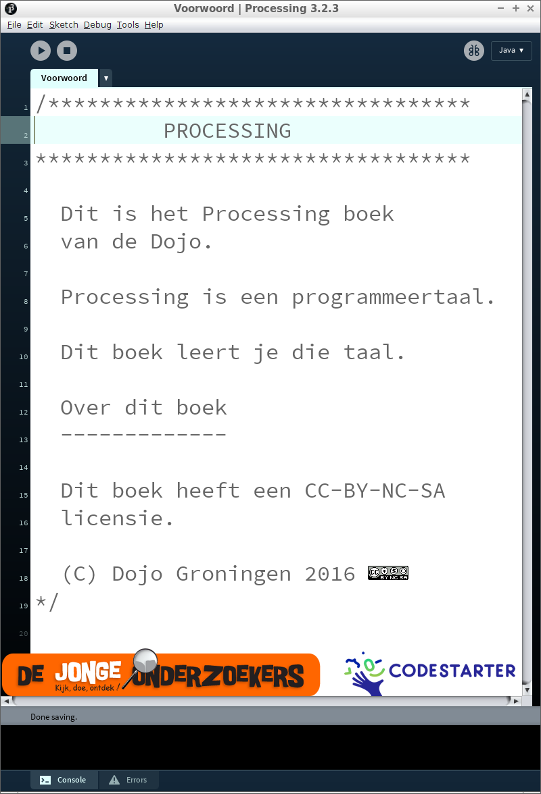

# Processing

# Voorwoord

Dit is het Processing boek van de Dojo. 
Processing is een programmeertaal. 
Dit boek leert je die programmeertaal.

## Over dit boek

Dit boek heeft een CC-BY-NC-SA licensie.

(C) Dojo Groningen 2016

Het is nog een beetje een slordig boek.
Zo staat bijvoorbeeld het plaatje
dat eigenlijk op de kaft moet staan op pagina twee.
Er zitten tiepvauten in en de opmaak is ni`et altij`d *even mo*oi.

Daarom staat dit boek op een GitHub.
Om precies te zijn, op 
https://github.com/richelbilderbeek/Dojo .
Hierdoor kan iedereen die dit boek te slordig vindt
minder slordig maken.
