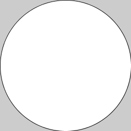
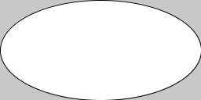
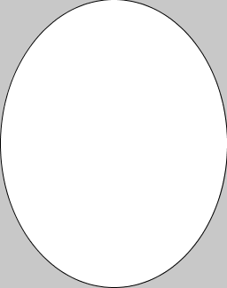
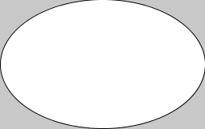
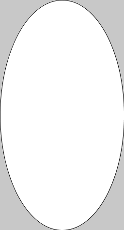
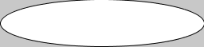
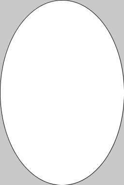
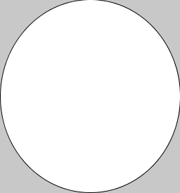

# `width` en `height`

`width` en `height` zijn ingebouwde variabelen in Processing, die handig zijn om te gebruiken zodat je programma nog werkt als je de grootte van je scherm aanpast.

Stel dat je een programma maakt wat een ovaal tekent die het scherm opvult, deze zou er zo uit kunnen zien:
```
void setup() {
  size(256, 256);
  ellipse(128, 128, 256, 256);
}
```
Dit programma tekent dit:



Maar dit programma werkt alleen voor een scherm wat 256 bij 256 pixels is. Dat is natuurlijk onhandig, want elke keer als je een nieuwe grootte kiest moet je een heleboel code opnieuw typen!

Als we de breedte en hoogte van het scherm weten, weten we ook welke getallen in `ellipse` moeten. De x cordinaat van de ellipse is namelijk de helft van de breedte, de y cordinaat de helft van de hoogte. En de breedte en hoogte van de `ellipse` zijn hetzelfde als die van het scherm.

Gelukkig weet Processing de breedte en hoogte van het scherm. De breedte van het scherm heet in Processing `width` en de hoogte heet `height`. Deze getallen worden bepaald zodra je size gebruikt om de grootte van je scherm te defineren.

Het programma wat een ovaal tekent die het scherm opvult, ziet er dan zo uit:
```
void setup() {
  size(256, 256);
  ellipse(width/2, height/2, width, height);
}
```
Maar nu past de ovaal nog steeds als we de getallin in `size` veranderen!


