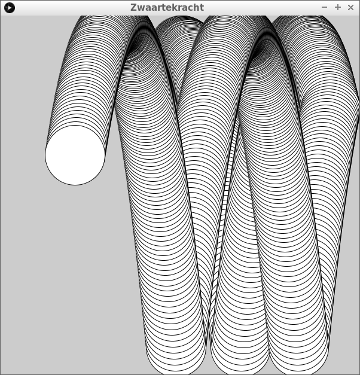
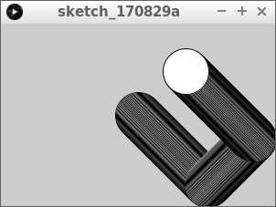
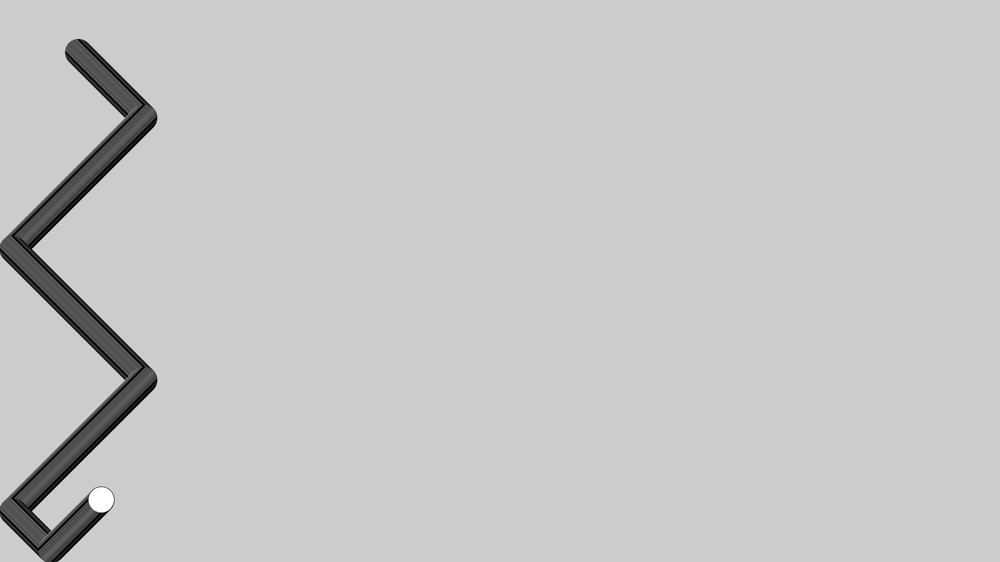
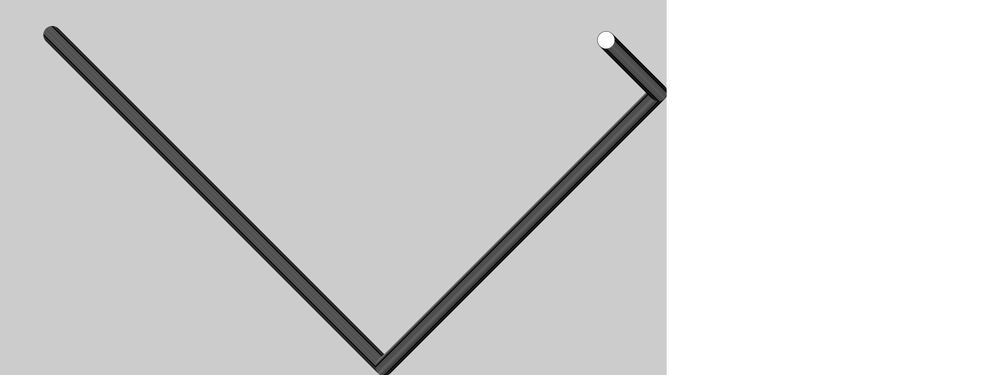
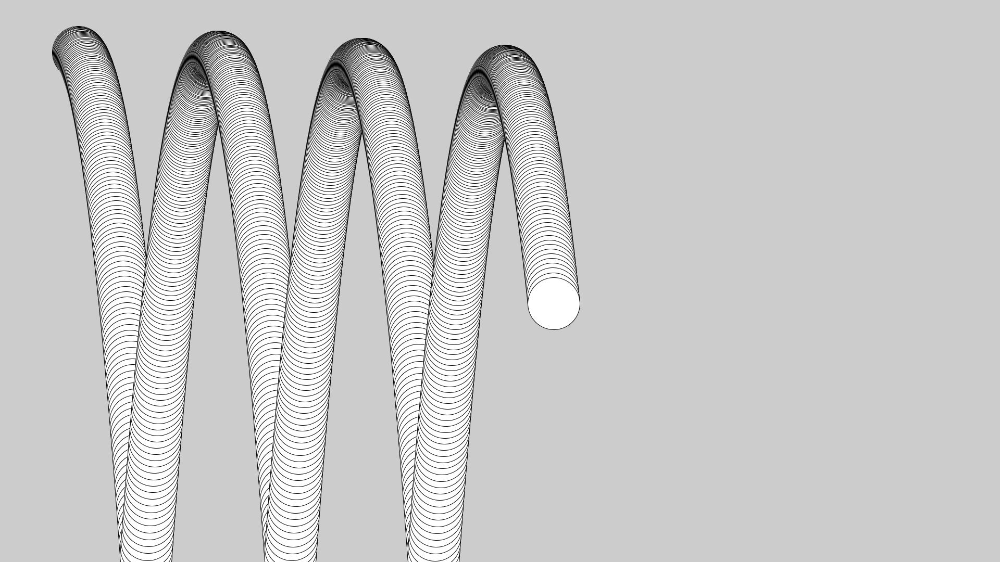
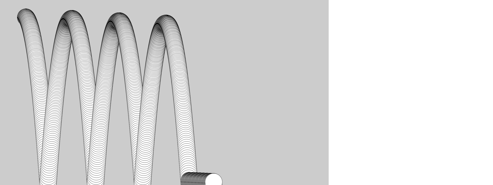

# Zwaartekracht

In deze les gaan we zwaartekracht programmeren.

Het ziet er zo uit:



We gaan in deze les twee variabelen en twee `if`-statements gebruiken. 

## Opdracht 1

Wat doet deze code?

```c++
float x = 150;
float y = 100;
float snelheid_naar_rechts = 1;
float snelheid_omlaag = 1;

void setup()
{
  size(300, 200);
}

void draw()
{
  ellipse(x, y, 50, 50);
  x = x + snelheid_naar_rechts;
  y = y + snelheid_omlaag;
  if (x > 275)
  {
    snelheid_naar_rechts = -snelheid_naar_rechts;
  }
  if (x < 25)
  {
    snelheid_naar_rechts = -snelheid_naar_rechts;
  }
  if (y > 175)
  {
    snelheid_omlaag = -snelheid_omlaag;
  }
}
```

## Oplossing 1



## Opdracht 2

Zorg dat het programma full-screen wordt


## Oplossing 2

```c++
float x = 150;
float y = 100;
float snelheid_naar_rechts = 1;
float snelheid_omlaag = 1;

void setup()
{
  fullScreen();
}

void draw()
{
  ellipse(x, y, 50, 50);
  x = x + snelheid_naar_rechts;
  y = y + snelheid_omlaag;
  if (x > 275)
  {
    snelheid_naar_rechts = -snelheid_naar_rechts;
  }
  if (x < 25)
  {
    snelheid_naar_rechts = -snelheid_naar_rechts;
  }
  if (y > 175)
  {
    snelheid_omlaag = -snelheid_omlaag;
  }
}
```

## Opdracht 3



Zorg dat de bal goed aan de onderkant stuitert. 

 | Tip: vervang `175` door `height - 25`
:-------------:|:----------------------------------------: 

## Oplossing 3

```c++
float x = 150;
float y = 100;
float snelheid_naar_rechts = 1;
float snelheid_omlaag = 1;

void setup()
{
  fullScreen();
}

void draw()
{
  ellipse(x, y, 50, 50);
  x = x + snelheid_naar_rechts;
  y = y + snelheid_omlaag;
  if (x > 275)
  {
    snelheid_naar_rechts = -snelheid_naar_rechts;
  }
  if (x < 25)
  {
    snelheid_naar_rechts = -snelheid_naar_rechts;
  }
  if (y > height - 25)
  {
    snelheid_omlaag = -snelheid_omlaag;
  }
}
```

## Opdracht 4

Zorg dat de bal goed aan de rechterkant stuitert.



## Oplossing 4

```c++
float x = 150;
float y = 100;
float snelheid_naar_rechts = 1;
float snelheid_omlaag = 1;

void setup()
{
  fullScreen();
}

void draw()
{
  ellipse(x, y, 50, 50);
  x = x + snelheid_naar_rechts;
  y = y + snelheid_omlaag;
  if (x > width - 25)
  {
    snelheid_naar_rechts = -snelheid_naar_rechts;
  }
  if (x < 25)
  {
    snelheid_naar_rechts = -snelheid_naar_rechts;
  }
  if (y > height - 25)
  {
    snelheid_omlaag = -snelheid_omlaag;
  }
}
```

## Eindopdracht

Voeg onderaan de `draw` functie toe:

```c++
snelheid_omlaag += 0.1;
```

Maak de bal twee keer zo groot.



Als je figuur `Zwaartekracht eindopdracht ook goed` krijgt, krijg je ook
een sticker.

 | Soms gebeuren er onverwachte dingen in programmeren!
:-------------:|:----------------------------------------: 


