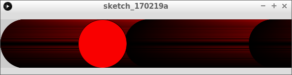

# Zwaartekracht

In deze les gaan we zwaartekracht programmeren.

Het ziet er zo uit:


We gaan in deze les twee variabelen en twee `if`-statements gebruiken. 

## Wat weten we al?

Dit is een eeuwig horizontaal stuiterende bal:

```
float x = 300; 
float dx = 1; //Snelheid in de x richting

void setup()
{
  size(600, 100);
}

void draw()
{
  ellipse(x,50,100,100);
  x = x + dx;
  if (x > 600 || x < 0)
  {
    dx = -dx;
  }
}

```

## Vragen 

 * 1. Wat doet dit programma?
 * 2. In welke richting beweegt de ovaal in het begin? In welke regel zie je dat?
 * 3. Blijft de ovaal zichtbaar op het scherm?
 * 4. Zorg ervoor dat de ovaal netjes op het scherm zichtbaar blijft. Hij moet 100 bij 100 pixels groot blijven

## Oplossing

 * 1. De bal stuitert horizontaal: eerste gaat 'ie rechts, bij de rand verandert deze van richting naar links.
      Weer aan de linkerkant, stuitert de bal weer naar rechts
 * 2. Naar rechts. Dit zie je aan `x = x + dx` (dit zorgt ervoor dat de bal beweegt) en `float dx = 1`. Hierdoor
      wordt de eerste regel dus `x = x + 1`. Als `x` meer wordt, gaat de bal meer naar rechts
 * 3. Nee, de ovaal gaat een stuk het veld uit


```
float x = 300; 
float dx = 1; //Snelheid in de x richting

void setup()
{
  size(600, 50);
}

void draw()
{
  ellipse(x,50,100,100);
  x = x + dx;
  if (x > 550 || x < 50)
  {
    dx = -dx;
  }
}
```

## Gas geven

Nu gaat een bal altijd `dx` naar links of naar rechts. 
Een bal kan ook steeds sneller gaan.
Dit kun je doen door `dx` te veranderen!

Zet nu deze code in Processing:

```
float x = 50; 
float dx = 0; //Snelheid in de x richting
float a = 1; //Versnelling

void setup()
{
  size(600, 100);
}

void draw()
{
  ellipse(x,50,100,100);
  x = x + dx;
  dx = dx + a;
  if (x > 650)
  {
    x = 50;
    dx = 0;
  }
}
```

## Vragen

 * 1. Wat zie je gebeuren?
 * 2. Waarom staat er `float dx = 0`?
 * 3. In het `if` statement staat `x = 50`. Wat doet dit?
 * 4. In het `if` statement staat `dx = 0`. Wat doet dit?
 * 5. Verander de code in het `if` statement van `dx = 0` naar `dx = -dx`. Wat doet dit?

## Oplossing

 * 1. De bal gaat naar rechts. De bal gaat ook steeds sneller naar rechts. 
   Als de bal rechts is, begint deze weer links
 * 2. Dan staat de bal in het begin stil
 * 3. Deze zet de bal weer naar links
 * 4. Deze zet de bal weer stil
 * 5. De bal gaat nu stuiteren als een stuiterbal

## Kleur veranderen

Nu gaan we de bal iets extra's laten doen: van zwart naar rood laten verkleuren.

## Opdracht




 * Laat de bal nog steeds stuiteren tegen de rechterkant van het scherm
 * Maak een extra variabele aan met naam `r` (van `rood`)
 * `r` begint op nul en wordt steeds een hoger
 * Als `r` groter is dan 255, dan wordt `r` nul
 * `r` bepaalt de kleur van de bal: 
    * als `r` nul is, is de bal zwart
    * als `r` 255 is, is de bal rood

## Oplossing

```
float x = 50; 
float dx = 1; //Snelheid in de x richting
float r = 0; //Roodheid

void setup()
{
  size(600, 100);
}

void draw()
{
  fill(r, 0, 0);
  ellipse(x,50,100,100);
  x = x + dx;
  if (x > 650)
  {
    x = 50;
  }
  r = r + 1;
  if (r > 255)
  {
    r = 0;
  }
}
```

## Zwaartekracht

De zwaartekracht trekt aan voorwerpen. Iets dat omlaag valt, gaat hierdoor steeds sneller vallen.
Iets dat omhoog gaat, gaat eerst steeds langzamer omhoog, en gaat daarna ook vallen.
In de natuukunde gebruiken ze `g` (van 'gravity', dit is Engels voor zwaartekracht)
voor de zwaartekracht.

## Opdacht

 * Laat de bal nu als een stuiterbal vallen en stuiteren
 * Gebruik de variabele naam `g` inplaats van `a`
 * De bal moet verticaal (van omhoog naar omlaag) versnellen
 * De bal moet horizontaal (van links naar rechts) even snel blijven gaan
