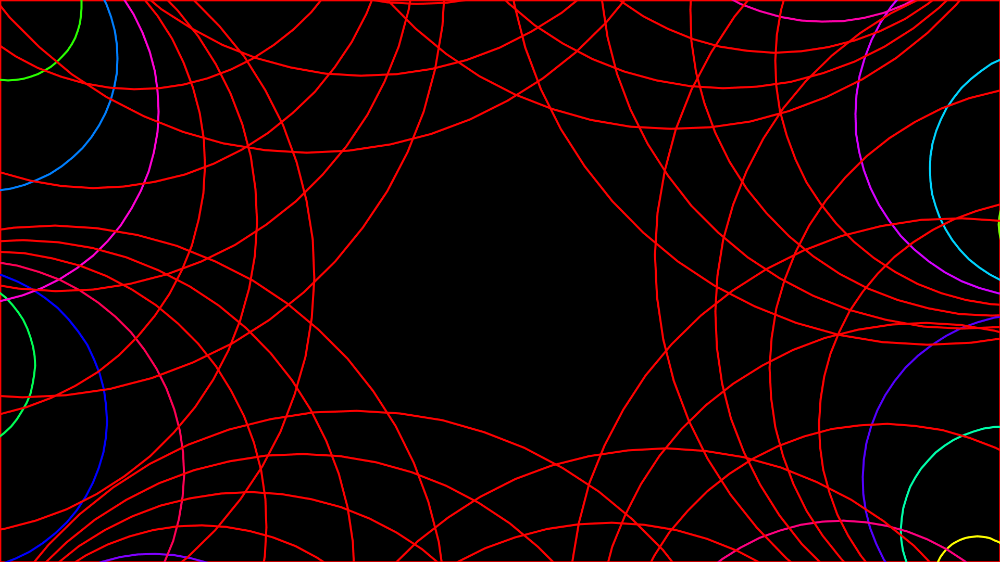
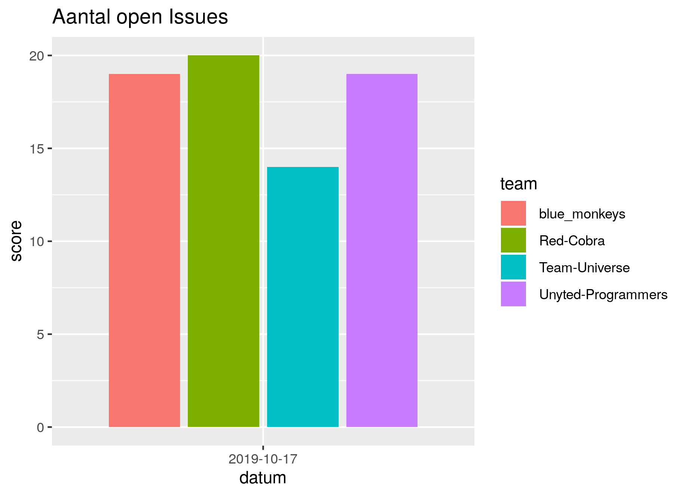

# Dojo

Aan computers vertellen wat ze moeten doen is de kern van programmeren. 
Wil jij dit ook kunnen? Elke donderdagavond kun je bij de Dojo
leren hoe je iets gaafs (games!) maakt op de computer.

Eerst werk je los uit boekjes om het begin te leren. Daarna ga je
meedoen in een team. En misschien dat je daarna een team gaat leiden!

Voorkennis is niet nodig.

Deze avond is een cursusavond, waarin samen leren programmeren voorop staat. 
Je begin altijd met Processing. Daarna, binnen een team, mogen jullie zelf kiezen.

Zie 'Lesrooster' hieronder voor meer detail.

## Agenda

 * Donderdag 9 januari: eerste les nieuwe periode
 * Donderdag 20 februari: geen les, wegens voorjaarsvakantie
 * Zaterdag 29 februari: Open Dag DJO Groningen, ?12:00-?16:00,
 * Donderdag 12 maart: BPD ('Bijna Pi Dag'): een avond met :pizza:
 * Zaterdag 14 maart: Pi Dag: om 00:03:14 (pi minuten na middernacht) op perron P van CS Groningen
 * Zaterdag 14 maart: DigiDoeDag, Groningen, tijd nog onbekend
 * Donderdag 30 april: geen les, wegens meivakantie
 * Donderdag 21 mei: geen les, wegens hemelvaartsdag
 * Donderdag 25 juni: eindpresentaties
 * Donderdag 2 juli: laatste les voor de zomervakantie

## Lesrooster

 * Dag: Elke donderdagavond, behalve op feestdagen en in de kerstvakantie

Groep       |Pico's |Nanos' |Uno's  |Mega's
------------|-------|-------|-------|------
Leeftijd    | 08-13 | 08-13 | 13-18 | 18-88
Inloop      | 18:15 | 18:15 | 19:15 | 20:15
Start les   | 18:30 | 18:30 | 19:30 | 20:30
Pauze les   | 19:15 | 19:15 | 20:00 | 21:00
Vervolg les | 19:30 | 19:30 | 20:15 | 21:15
Einde les   | 20:00 | 20:00 | 21:00 | 22:00

 * Locatie: De Jonge Onderzoekers Groningen, [www.djog.nl](https://www.djog.nl), 
   Dirk Huizingastraat 13
 * Kosten per leerling:
   * September t/m december: 27,50 euro
   * Januari tot en met mei: 27,50 euro
   * Juni en juli: gratis, de lessen zijn dan op de vrijdag!
 * Leeftijd: 8-18 jaar [*](docs/veelgestelde_vragen.md)
 * Benodigdheden: Het zou fijn zijn als je een laptop met WiFi meeneemt. 
   Maar wij hebben ook wel wat laptops te leen. Neem een USB stick mee als
   je je code wilt bewaren.

Je eerste (proef)les kan elke avond zijn. Ook zonder opgave.

Heb je nog een vraag? Zie [Veelgestelde vragen](docs/veelgestelde_vragen.md)

## Screenshots van leerlingwerk

## Links

 * [GitLab](http://51.15.53.32)
 * [Lesmateriaal 'git voor jonge tieners'](https://github.com/richelbilderbeek/git_voor_jonge_tieners)
 * [Lesmateriaal 'Processing voor jonge tieners'](https://github.com/richelbilderbeek/processing_voor_jonge_tieners)
 * [Lesmateriaal 'Arduino voor jonge tieners'](https://github.com/richelbilderbeek/arduino_voor_jonge_tieners)

### Teams voorjaar 2019

Teamnaam          |Website
------------------|---------------
Rustig            |[Team Rustig](https://github.com/djog/djog_rust)
Snek              |[Team Snek](https://github.com/djog/the_hunger_games)

### Teams najaar 2019

Teamnaam               |Website
-----------------------|---------------
Team Blue Monkeys      |[https://github.com/djog/blue_monkeys](https://github.com/djog/blue_monkeys)
Team Octane            |[https://github.com/djog/djog_unos_2019](https://github.com/djog/djog_unos_2019)
Team Red Cobra         |[https://github.com/djog/Red-Cobra](https://github.com/djog/Red-Cobra)
Team Universe          |[https://github.com/djog/Team-Universe](https://github.com/djog/Team-Universe)
Team Unyted Programmers|[https://github.com/djog/Unyted-Programmers](https://github.com/djog/Unyted-Programmers)

### Teams schooljaar 2018-2019 

Groep|Naam           |Website                                                                         |YouTube
-----|---------------|--------------------------------------------------------------------------------|--------------------------------------------------------------------------------
A    |Pico's         |[Processing](https://github.com/richelbilderbeek/processing_voor_jonge_tieners) |[hier](https://www.youtube.com/playlist?list=PLu8_ZyzXyRDGx6-L49ts6S70YfGnCP83F)
A    |Team Facilis   |[djog_picos_2018](https://github.com/richelbilderbeek/djog_picos_2018)          |.
A    |Team Red Cobra |[djog_nanos_2018](https://github.com/richelbilderbeek/djog_nanos_2018)          |[hier](https://www.youtube.com/playlist?list=PLu8_ZyzXyRDEhG_MPfrOk52NeVP0Np_Ow)
B    |Team Octane    |[djog_unos_2018](https://github.com/richelbilderbeek/djog_unos_2018)            |[hier](https://www.youtube.com/playlist?list=PLu8_ZyzXyRDGWROB_20d-upONVDL5azVR)
C    |Team Octane    |[djog_unos_2018](https://github.com/richelbilderbeek/djog_unos_2018)            |[hier](https://www.youtube.com/playlist?list=PLu8_ZyzXyRDGWROB_20d-upONVDL5azVR)

## Build status

Branch  |
--------|-----------------------------------------------------------------------------------------------------------------------------
`master`|

